# Named colors

The names of available colors are stored in alphabetical order in the dictionary `Colors.color_names`:

```julia
color_names = Dict(
    "aliceblue"            => (240, 248, 255),
    "antiquewhite"         => (250, 235, 215),
    "antiquewhite1"        => (255, 239, 219),
    ...
```

Named colors are available as `RGB{N0f8}` using:

```julia
julia> using Colors

julia> color = colorant"indianred"
RGB{N0f8}(0.804,0.361,0.361)
```

or

```julia
julia> cname = "indianred"
"indianred"

julia> color = parse(Colorant, cname)
RGB{N0f8}(0.804,0.361,0.361)
```

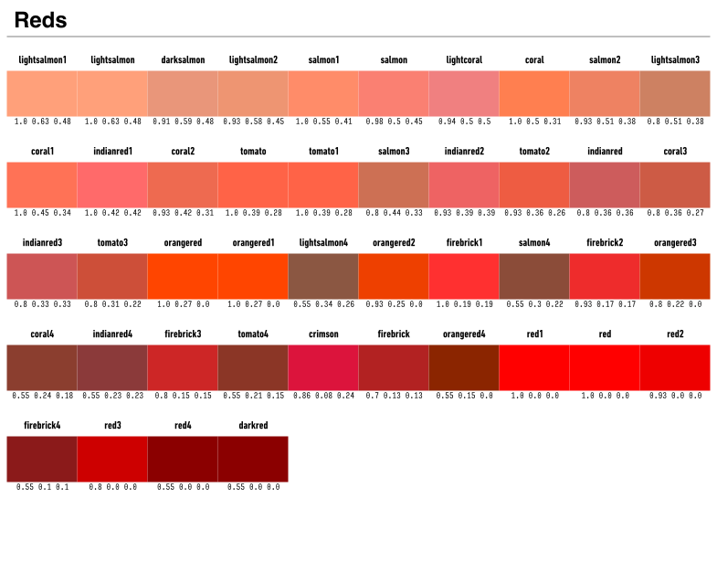

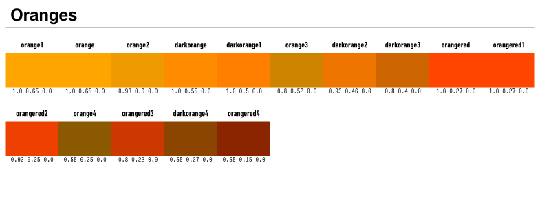

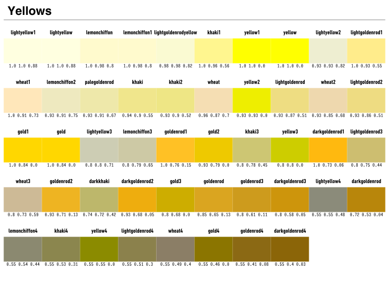

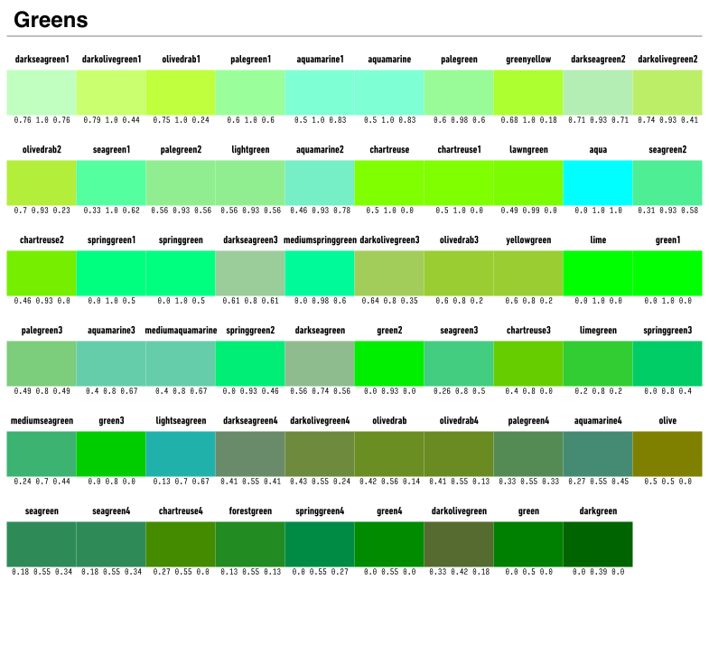

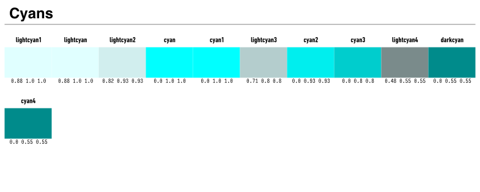

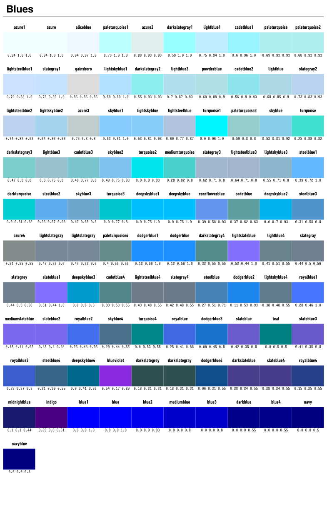

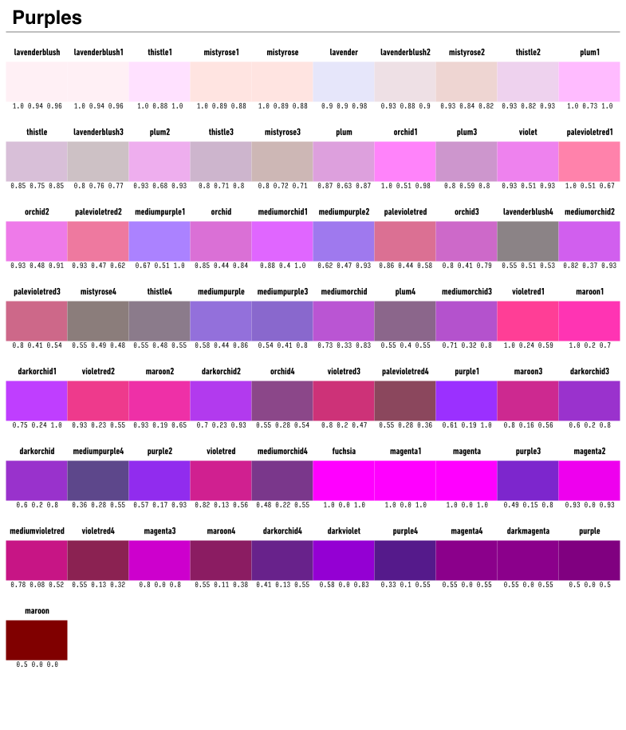

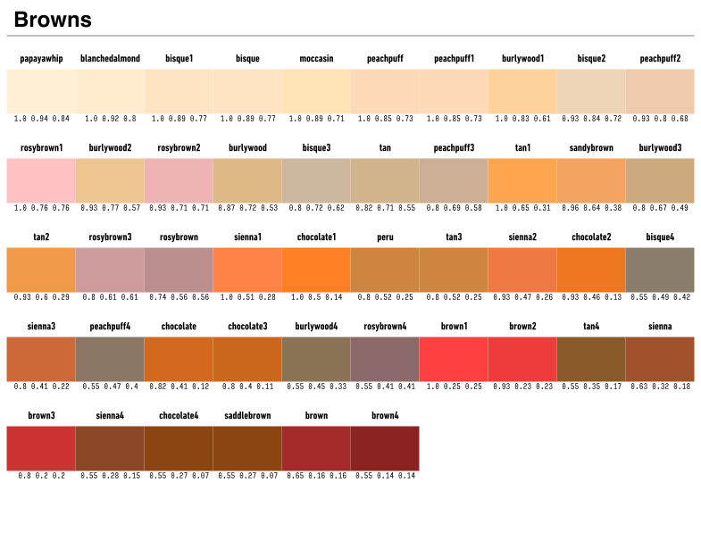

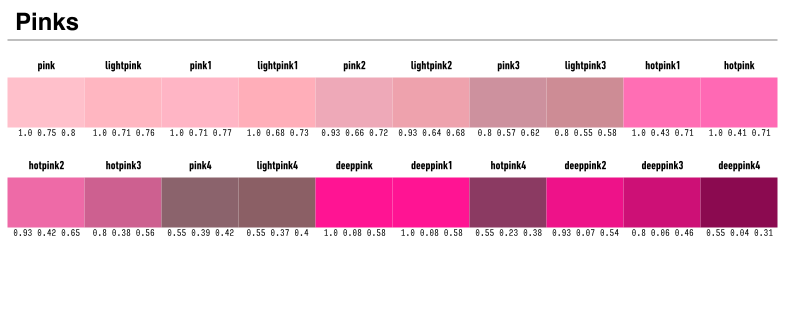

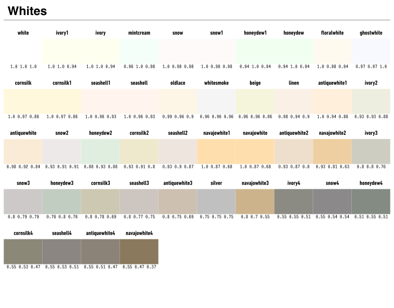

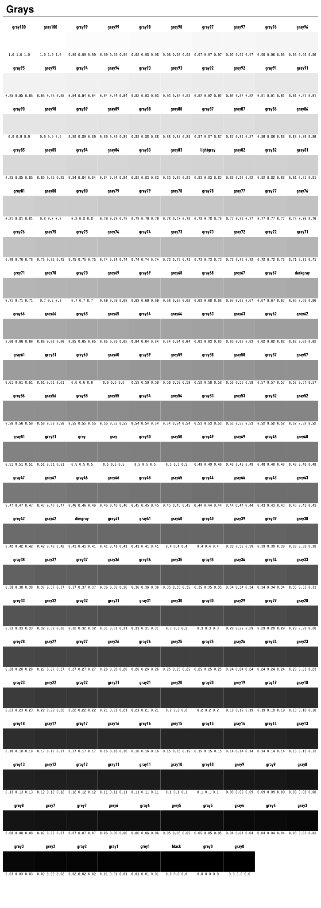


These colors can be converted to `RGB{N0f32}` (for example) using:

```julia
julia> using FixedPointNumbers
julia> RGB{N0f32}(color)
RGB{N0f32}(0.803922,0.360784,0.360784)
```

